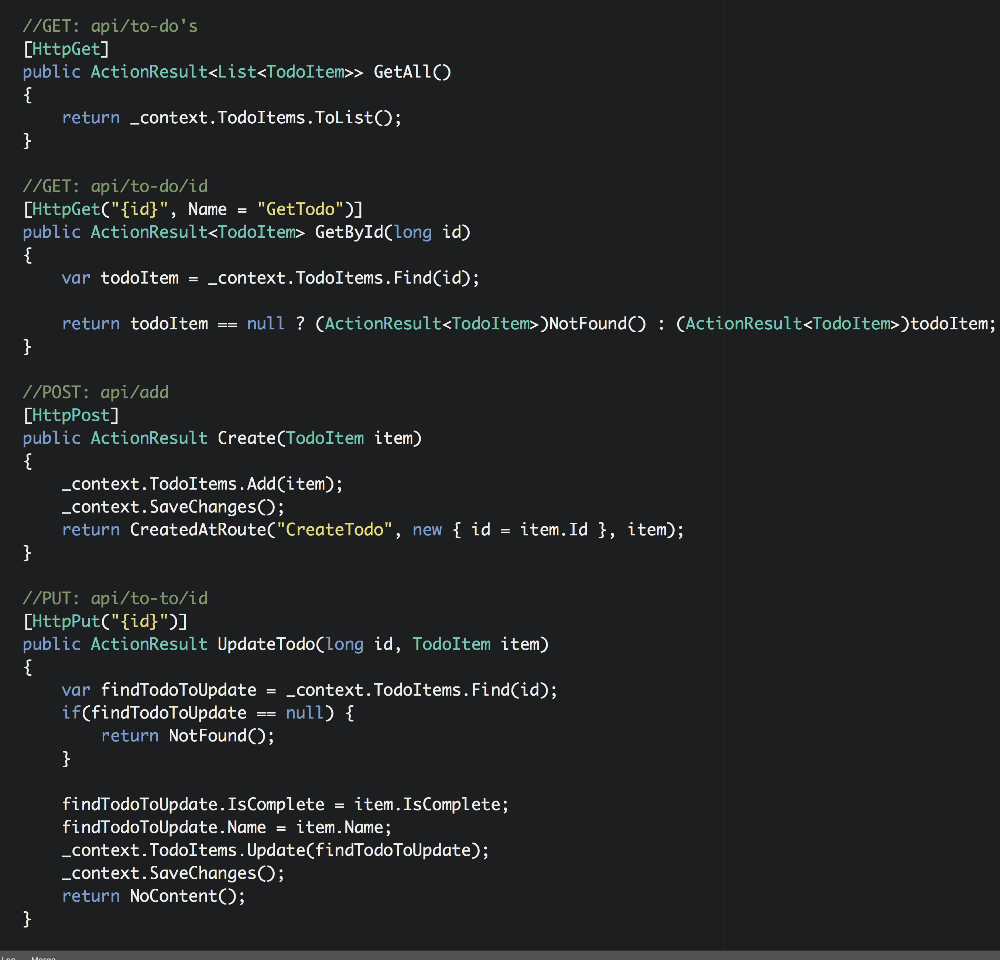

# ASP.NET-WebAPI
A simple ASP.NET WEBAPI

This project demonstrates how to create a RESTful based API using ASP.NET WebAPI. 
There is no database connection. I used the EntityFrameWorkCore package to use an in memory ddatabase.
I created a models folder to hold the Todo model and connected that model to the EntityFrameworkCore.

      

